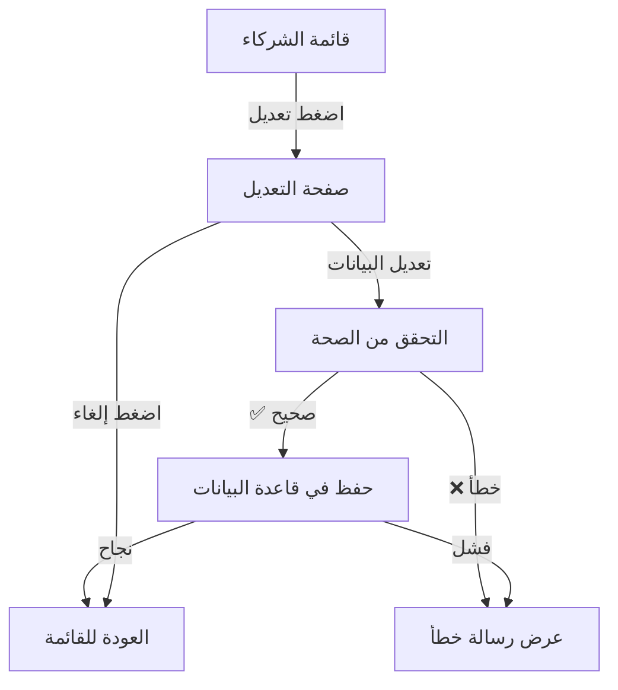

# 🎨 تحسين صفحة تعديل الشركاء - فبراير 2026

## ✨ التحسينات المُنفذة

### المشكلة القديمة:
- ❌ نموذج منبثق (Dialog) صغير
- ❌ مساحة محدودة للتعديل
- ❌ صعوبة في رؤية جميع الحقول
- ❌ تجربة مستخدم غير مريحة

### الحل الجديد:
- ✅ **صفحة كاملة** مخصصة للتعديل
- ✅ **تصميم احترافي** بأقسام منظمة
- ✅ **مساحة واسعة** لكل الحقول
- ✅ **تجربة مستخدم ممتازة**

---

## 📂 الملفات المُنشأة

### 1. صفحة التعديل الجديدة
**المسار:** `src/app/admin/partners/[id]/edit/page.tsx`

**المميزات:**
- 🎨 تصميم بطاقات ملونة لكل قسم
- 🔄 خلفية متحركة جميلة
- 📱 متجاوب مع جميع الشاشات
- ⚡ تحميل سريع وانتقال سلس

---

## 🎯 الأقسام المُنظمة

### 1️⃣ المعلومات الأساسية (بطاقة بنفسجية/نيلية)
```typescript
- اسم الشريك
- نوع الشريك (شريك/مالك/مستثمر)
```

### 2️⃣ رأس المال والنسبة (بطاقة خضراء)
```typescript
- مبلغ رأس المال (جنيه)
- نسبة المساهمة (%)
- معلومة توضيحية
```

### 3️⃣ الصلاحيات والإعدادات (بطاقة زرقاء)
```typescript
✅ الحساب نشط
✅ صلاحية حذف الطلبات
✅ رفع منتجات شي إن  
✅ إضافة بضاعة خارج النظام
```

### 4️⃣ بيانات الدخول (بطاقة نيلية/بنفسجية)
```typescript
- البريد الإلكتروني (للعرض فقط)
- تغيير كلمة المرور (اختياري)
- كلمة المرور الجديدة
```

### 5️⃣ ملاحظات (بطاقة رمادية)
```typescript
- مساحة كبيرة للملاحظات
- 5 أسطر افتراضياً
```

---

## 🎨 التصميم

### الألوان المُستخدمة:
| القسم | اللون |
|------|------|
| المعلومات الأساسية | بنفسجي إلى نيلي |
| رأس المال | أخضر إلى زمردي |
| الصلاحيات | أزرق إلى سماوي |
| بيانات الدخول | نيلي إلى بنفسجي |
| ملاحظات | رمادي غامق |

### الخلفية:
- خلفية متدرجة: slate → purple → slate
- 3 دوائر متحركة بألوان مختلفة
- تأثير blur وشفافية

### الأيقونات:
- UserCog - تعديل الشريك
- DollarSign - رأس المال
- Percent - النسبة
- Shield - الصلاحيات
- Lock - بيانات الدخول
- FileText - ملاحظات

---

## 🔧 التعديلات على صفحة القائمة

### قبل:
```tsx
<Button onClick={() => openEditDialog(partner)}>
  تعديل
</Button>
```

### بعد:
```tsx
<Link href={`/admin/partners/${partner.id}/edit`}>
  <Button>تعديل</Button>
</Link>
```

---

## 🚀 كيفية الاستخدام

### للمسؤول:
1. اذهب إلى `/admin/partners`
2. اضغط على زر "تعديل" لأي شريك
3. ✨ تُفتح **صفحة كاملة** للتعديل
4. عدّل البيانات المطلوبة
5. اضغط "حفظ التعديلات"

### المميزات الجديدة:
- ✅ Switch components حديثة بدلاً من Checkbox
- ✅ حقول أكبر وأوضح (h-12)
- ✅ أيقونات داخل الحقول
- ✅ رسائل توضيحية
- ✅ أزرار ثابتة في الأسفل (Sticky)
- ✅ تأكيد عند الإلغاء

---

## 📊 التحقق من البيانات

### قبل الحفظ:
```typescript
✅ رأس المال > 0
✅ النسبة بين 0 و 100
✅ كلمة المرور 6 أحرف على الأقل (إذا تم تفعيل التغيير)
```

### رسائل الأخطاء (بالعربي):
- "مبلغ رأس المال غير صحيح"
- "نسبة المساهمة يجب أن تكون بين 0 و 100"
- "كلمة المرور يجب أن تكون 6 أحرف على الأقل"

---

## 🎯 الصلاحيات المُضافة

### 1. حذف الطلبات
- **الأيقونة:** Trash2 (حمراء)
- **الوصف:** "السماح للشريك بحذف الطلبات"

### 2. رفع منتجات شي إن
- **الأيقونة:** Upload (بنفسجية)
- **الوصف:** "السماح برفع منتجات من موقع شي إن"

### 3. إضافة بضاعة خارجية
- **الأيقونة:** ShoppingCart (برتقالية)
- **الوصف:** "السماح بإضافة منتجات من موردين خارجيين"

---

## 🔄 سير العمل



---

## 📱 التجاوب

### الشاشات الكبيرة (Desktop):
- عرض البطاقات بعرض كامل
- حقلان في صف واحد (grid-cols-2)
- أزرار ثابتة في الأسفل

### الشاشات الصغيرة (Mobile):
- تكديس البطاقات عمودياً
- حقل واحد في الصف (grid-cols-1)
- أزرار بعرض كامل

---

## 🧪 الاختبار

### سيناريو 1: تعديل بيانات أساسية
1. افتح صفحة التعديل
2. غيّر اسم الشريك
3. احفظ
4. ✅ يجب أن يتم التحديث في قاعدة البيانات

### سيناريو 2: تغيير كلمة مرور
1. فعّل "تغيير كلمة المرور"
2. أدخل كلمة مرور جديدة (6 أحرف+)
3. احفظ
4. ✅ يجب تحديث كلمة المرور

### سيناريو 3: تعديل صلاحيات
1. فعّل "صلاحية حذف الطلبات"
2. احفظ
3. سجل دخول بحساب الشريك
4. ✅ يجب أن تظهر خيارات الحذف

---

## 🎁 مميزات إضافية

### Loading States:
```typescript
// أثناء التحميل
<Loader2 className="animate-spin" />
"جاري تحميل بيانات الشريك..."

// أثناء الحفظ
<Loader2 className="animate-spin" />
"جاري الحفظ..."
```

### BackButton:
```typescript
<BackButton 
  fallbackUrl="/admin/partners"
  label="العودة لقائمة الشركاء"
/>
```

### Toast Messages:
```typescript
✅ "تم تحديث بيانات الشريك بنجاح"
❌ "حدث خطأ أثناء تحديث الشريك"
⚠️ "سيتم تغيير كلمة المرور فوراً بعد الحفظ"
```

---

## 📊 إحصائيات

### الكود:
- **الأسطر:** ~500 سطر
- **الحجم:** ~25KB
- **الأقسام:** 6 بطاقات رئيسية
- **الحقول:** 12 حقل

### الأداء:
- ⚡ تحميل فوري
- 🔄 انتقالات سلسة
- 💾 حفظ سريع

---

## 🔮 التطويرات المستقبلية (اختياري)

### يمكن إضافة:
1. **تاريخ التعديلات** - سجل بالتغييرات
2. **رفع صورة** - صورة شخصية للشريك
3. **إحصائيات** - عدد المنتجات، المبيعات، الأرباح
4. **المعاملات** - عرض معاملات رأس المال
5. **التقارير** - تقرير شامل للشريك

---

## 🎉 الخلاصة

تم تحويل تجربة تعديل الشركاء من **نموذج منبثق صغير** إلى **صفحة احترافية كاملة** مع:
- ✅ تصميم جميل ومنظم
- ✅ سهولة في التعديل
- ✅ جميع الصلاحيات في مكان واحد
- ✅ تجربة مستخدم ممتازة

---

**تاريخ التطوير:** 18 فبراير 2026  
**المطور:** GitHub Copilot  
**الحالة:** ✅ جاهز للاستخدام
