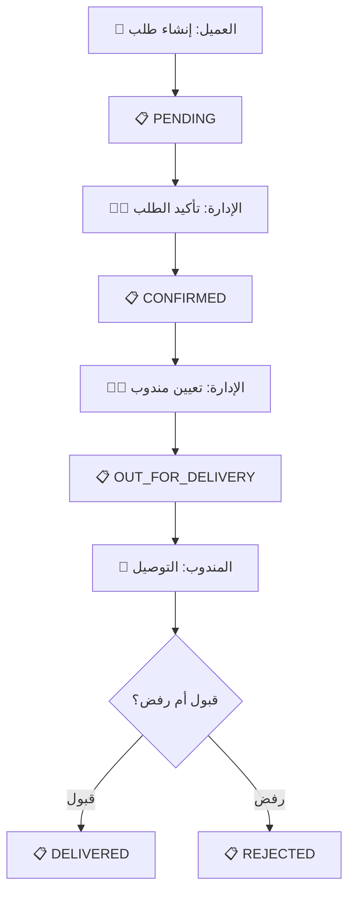

# 🧪 نظام اختبار الطلبات - Order Testing System

## 📖 مقدمة

هذا الدليل يساعدك على اختبار **رحلة الطلب الكاملة** من العميل إلى الإدارة إلى البائع إلى مندوب التوصيل.

---

## 🚀 بدء الاختبار (خطوتان فقط!)

### الطريقة 1️⃣: استخدام الملف الجاهز (الأسهل!)

قم بتشغيل:
```bash
test-orders.bat
```

سيظهر لك قائمة:
```
[1] تشغيل المشروع + فتح المتصفح
[2] تشغيل Prisma Studio
[3] تشغيل كل شيء معاً
[4] فتح دليل التجربة
[5] فتح الدليل السريع
```

### الطريقة 2️⃣: يدوياً

```bash
# تشغيل المشروع
npm run dev

# في نافذة أخرى
npm run prisma:studio
```

---

## 📚 الملفات المساعدة

نوفر لك **4 ملفات** للمساعدة:

### 1. 📘 [ORDER_TEST_GUIDE.md](./ORDER_TEST_GUIDE.md)
**دليل تفصيلي كامل** (الأكثر شمولاً)
- شرح مفصل لكل خطوة
- لقطات شاشة مقترحة
- حل المشاكل الشائعة
- سيناريوهات متقدمة

**استخدمه إذا:** كانت هذه أول مرة تجرب النظام

### 2. ⚡ [QUICK_TEST.md](./QUICK_TEST.md)
**دليل سريع** (5-10 دقائق)
- خطوات مختصرة
- روابط جاهزة للنسخ
- بيانات تجريبية
- checklist سريع

**استخدمه إذا:** تريد اختباراً سريعاً

### 3. 🎯 [REFERENCE_CARD.md](./REFERENCE_CARD.md)
**بطاقة مرجعية** (للطباعة)
- جميع الحسابات والروابط
- أوامر سريعة
- حلول فورية
- يمكن طباعته

**استخدمه:** احتفظ به مفتوحاً أثناء الاختبار

### 4. 🖥️ [test-orders.bat](./test-orders.bat)
**ملف تشغيل تفاعلي**
- تشغيل المشروع بضغطة واحدة
- خيارات متعددة
- عرض الحسابات المتاحة

**استخدمه:** للتشغيل السريع

---

## 🎯 الخطوات الأساسية (نظرة سريعة)



### بالتفصيل:

1. **العميل** ← إنشاء حساب → إضافة منتجات → إنشاء طلب → `PENDING`
2. **الإدارة** ← رؤية الطلب → تأكيده → `CONFIRMED` → تعيين مندوب
3. **البائع** ← رؤية طلباته → تحضير المنتجات
4. **المندوب** ← رؤية الطلب → التوصيل → `DELIVERED` أو `REJECTED`

---

## 🔑 الحسابات الجاهزة

| الدور | البريد | كلمة المرور | الرابط |
|------|--------|--------------|--------|
| الإدارة | admin@store.com | admin123 | /admin |
| البائع | store@partner.com | Aazxc | /vendor |
| المندوب | delivery@partner.com | Aazxc | /delivery-dashboard |
| عميل جديد | customer@test.com* | customer123 | / |

*يجب إنشاؤه من الموقع

---

## ⏱️ جدول زمني مقترح

| المدة | النشاط |
|------|--------|
| 1 دقيقة | تشغيل المشروع و Prisma Studio |
| 1 دقيقة | إنشاء حساب عميل |
| 2 دقيقة | إنشاء طلب |
| 1 دقيقة | مراجعة كـ Admin |
| 30 ثانية | مراجعة كـ Vendor |
| 30 ثانية | مراجعة كـ Delivery |
| **~6 دقائق** | **المجموع** |

---

## ✅ معايير النجاح

### يجب أن يتحقق التالي:

#### للعميل:
- ✓ الطلب تم إنشاؤه بنجاح
- ✓ تلقى Order ID
- ✓ يستطيع رؤية الطلب في صفحة "طلباتي"

#### للإدارة:
- ✓ ترى الطلب الجديد فوراً
- ✓ تستطيع تأكيد الطلب
- ✓ تستطيع تعيين مندوب
- ✓ ترى جميع التفاصيل (عميل، بائع، منتجات)

#### للبائع:
- ✓ يرى الطلبات التي تحتوي منتجاته فقط
- ✓ لا يرى منتجات بائعين آخرين في نفس الطلب
- ✓ يرى العمولة المخصومة
- ✓ يرى صافي الأرباح

#### لمندوب التوصيل:
- ✓ يرى الطلبات المعينة له فقط
- ✓ يرى معلومات العميل والعنوان
- ✓ يستطيع تحديث حالة الطلب
- ✓ يرى المبلغ المطلوب تحصيله

---

## 🔍 أدوات المراقبة

### 1. Prisma Studio (http://localhost:5555)
راقب التغييرات الفورية في:
- جدول `Order` (الطلبات)
- جدول `OrderItem` (منتجات الطلب)
- جدول `Product` (المخزون)
- جدول `User` (المستخدمين)

### 2. Browser DevTools
- **Network Tab:** راقب API calls
- **Console:** شاهد errors/logs
- **Application → Local Storage:** راقب الـ cart

---

## 🐛 حل المشاكل

### مشكلة شائعة #1: "لا يوجد منتجات"
```bash
npm run prisma:seed
```

### مشكلة شائعة #2: "البائع لا يرى الطلب"
**السبب:** المنتج ليس له `vendorId`

**الحل:**
1. افتح Prisma Studio
2. اذهب لجدول `Product`
3. تحقق من أن المنتج له `vendorId` صحيح
4. إذا كان `null`، قم بتحديثه

### مشكلة شائعة #3: "المندوب لا يرى الطلب"
**السبب:** لم يتم تعيين المندوب

**الحل:**
1. سجل دخول كـ Admin
2. اذهب للطلبات
3. اختر الطلب
4. اضغط "تعيين مندوب"
5. اختر المندوب

---

## 🎬 سيناريوهات إضافية

بعد اختبار السيناريو الأساسي، جرب:

### 🔄 سيناريو 1: رفض الطلب
1. المندوب يحدّث الحالة إلى `REJECTED`
2. تحقق من إرجاع المنتجات للمخزون
3. تحقق من تحصيل رسوم التوصيل فقط

### 🛍️ سيناريو 2: طلب من عدة بائعين
1. أضف منتجات من `store@partner.com` و `stationery@partner.com`
2. تحقق من أن كل بائع يرى منتجاته فقط

### 💰 سيناريو 3: التقسيط
1. اختر خطة تقسيط عند إنشاء الطلب
2. تابع الأقساط في صفحة العميل

---

## 📊 Dashboard للمتابعة

افتح هذه اللوحات في نوافذ منفصلة:

```
نافذة 1: http://localhost:3000 (العميل)
نافذة 2: http://localhost:3000/admin (الإدارة)
نافذة 3: http://localhost:3000/vendor (البائع)
نافذة 4: http://localhost:3000/delivery-dashboard (المندوب)
نافذة 5: http://localhost:5555 (Prisma Studio)
```

---

## 📸 توثيق النتائج

نوصي بأخذ screenshots للتالي:
1. ✓ صفحة Checkout بعد إضافة المنتجات
2. ✓ تأكيد الطلب (Order ID)
3. ✓ الطلب في لوحة الإدارة
4. ✓ الطلب في لوحة البائع
5. ✓ الطلب في لوحة المندوب
6. ✓ الطلب في Prisma Studio

---

## 🎓 فهم النظام

### العلاقات الرئيسية:

```
User (العميل)
  ↓
Order (الطلب)
  ↓
OrderItem (منتجات الطلب)
  ↓
Product (المنتج)
  ↓
Vendor (البائع)
```

### تدفق البيانات:

1. العميل ينشئ `Order`
2. `Order` يحتوي على `OrderItem[]`
3. كل `OrderItem` مرتبط بـ `Product`
4. كل `Product` مرتبط بـ `Vendor` (اختياري)
5. `Order` يُعيّن لـ `DeliveryStaff`

---

## 🔐 أمان النظام

### ما تم تطبيقه:

- ✅ العميل يرى طلباته فقط
- ✅ البائع يرى منتجاته فقط في الطلبات
- ✅ المندوب يرى الطلبات المعينة له فقط
- ✅ الإدارة فقط تستطيع تعيين المندوبين
- ✅ لا يمكن تعديل الأسعار بعد إنشاء الطلب

---

## 🎯 الخطوات التالية

بعد الاختبار الناجح:

1. ✅ اختبار جميع حالات الطلب
2. ✅ اختبار التقسيط
3. ✅ إضافة إشعارات في الوقت الفعلي
4. ✅ إضافة تتبع GPS للمندوب
5. ✅ إضافة تقييمات للطلبات
6. ✅ إضافة chatbot للدعم

---

## 📞 احتياج مساعدة؟

| السؤال | الملف المناسب |
|--------|---------------|
| كيف أبدأ؟ | QUICK_TEST.md |
| أريد تفاصيل أكثر | ORDER_TEST_GUIDE.md |
| أريد مرجع سريع | REFERENCE_CARD.md |
| كيف أشغل المشروع؟ | test-orders.bat |

---

## 📝 ملاحظات

- **الوقت المتوقع:** 5-10 دقائق للاختبار الأساسي
- **المتطلبات:** Node.js، PostgreSQL، npm
- **التحضير:** تأكد من تشغيل `npm run prisma:seed`

---

## 🎉 نتمنى لك اختباراً موفقاً!

إذا واجهت أي مشكلة، راجع الملفات المرفقة أو تواصل معنا.

**تاريخ الإنشاء:** 9 يناير 2025  
**الإصدار:** 1.0

---

## 🔖 روابط سريعة

- [📘 الدليل الكامل](./ORDER_TEST_GUIDE.md)
- [⚡ الدليل السريع](./QUICK_TEST.md)
- [🎯 البطاقة المرجعية](./REFERENCE_CARD.md)
- [🖥️ ملف التشغيل](./test-orders.bat)
